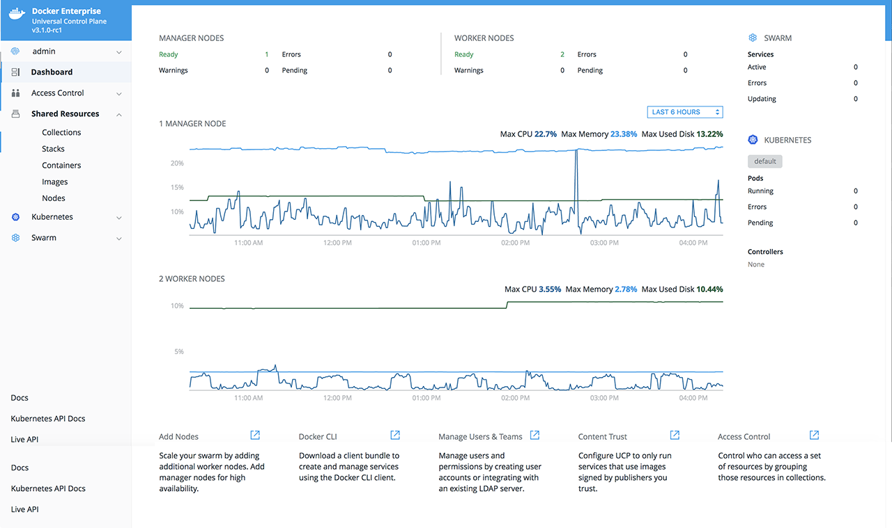
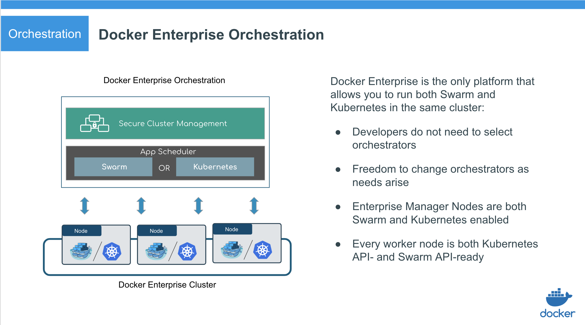
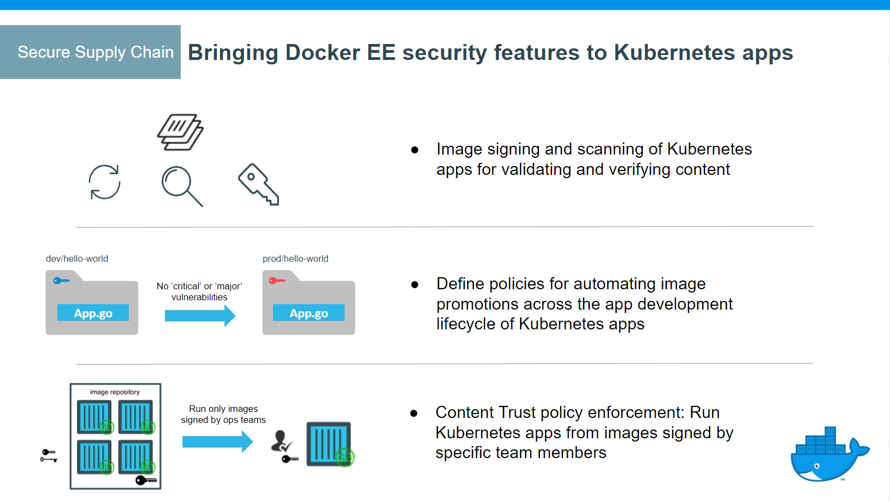
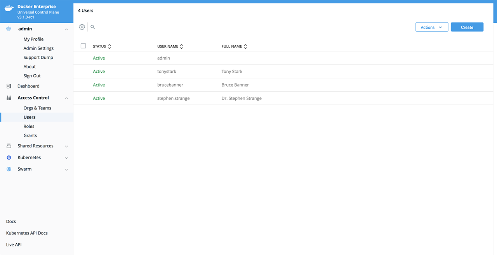

The Docker Enterprise platform is the leading container platform for continuous, high-velocity innovation. Docker is the only independent container platform that enables developers to seamlessly build and share any application — from legacy to modern — and operators to securely run them anywhere - from hybrid cloud to the edge.

Docker Enterprise is a secure, scalable, and supported container platform for building and
orchestrating applications across multi-tenant Linux, Windows Server 2016, and Windows Server 2019.

Docker Enterprise enables deploying highly available workloads using either the Docker Kubernetes Service or Docker Swarm. Docker Enterprise automates many of the tasks that orchestration requires, like provisioning pods, containers, and cluster
resources. Self-healing components ensure that Docker Enterprise clusters remain highly available.

Role-based access control (RBAC) applies to Kubernetes and Swarm orchestrators, and
communication within the cluster is secured with TLS.
[Docker Content Trust](/engine/security/trust/content_trust/) is enforced
for images on all of the orchestrators.

Docker Enterprise includes Docker Universal Control Plane (UCP), the
cluster management solution from Docker. UCP can be installed
on-premises or in your public cloud of choice, and helps manage your
cluster and applications through a single interface.

{: .with-border}

## Docker Enterprise features

Docker Enterprise provides multi-architecture orchestration using the Docker Kubernetes Service and
Docker Swarm orchestrators. Docker Enterprise enables a secure software supply chain, with policy-based image
promotion, image mirroring between registries - including Docker Hub, and signing & scanning enforcement for container images.

### Docker Kubernetes Service

The Docker Kubernetes Service fully supports all Docker Enterprise features, including
role-based access control, LDAP/AD integration, image scanning and signing enforcement policies,
and security policies.

Docker Kubernetes Services features include:

- Kubernetes orchestration full feature set
- CNCF Certified Kubernetes conformance
- Kubernetes app deployment via UCP web UI or CLI (`kubectl`)
- Compose stack deployment for Swarm and Kubernetes apps (`docker stack deploy`)
- Role-based access control for Kubernetes workloads
- Blue-Green deployments, for load balancing to different app versions
- Ingress Controllers with Kubernetes L7 routing
- [Pod Security Policies](https://kubernetes.io/docs/concepts/policy/pod-security-policy/) to define a set of conditions that a pod must run with in order to be accepted into the system
  - Note: Pod Security Policies are currently `Beta` status in Kubernetes 1.14
- Container Storage Interface (CSI) support
- iSCSI support for Kubernetes
- Non-disruptive Docker Enterprise platform upgrades (blue-green upgrades)
- Experimental features (planned for full GA in subsequent Docker Enterprise releases):
  - Kubernetes-native ingress (Istio)

In addition, UCP integrates with Kubernetes by using admission controllers,
which enable:

- Authenticating user client bundle certificates when communicating directly
  with the Kubernetes API server
- Authorizing requests via the UCP role-based access control model
- Assigning nodes to a namespace by injecting a `NodeSelector` automatically
  to workloads via admission control
- Keeping all nodes in both Kubernetes and Swarm orchestrator inventories
- Fine-grained access control and privilege escalation prevention without
  the `PodSecurityPolicy` admission controller
- Resolving images of deployed workloads automatically, and accepting or
  rejecting images based on UCP's signing-policy feature

The default Docker Enterprise installation includes both Kubernetes and Swarm
components across the cluster, so every newly joined worker node is ready
to schedule Kubernetes or Swarm workloads.

### Orchestration platform features

{: .with-border}

- Docker Enterprise manager nodes are both Swarm managers and Kubernetes masters,
  to enable high availability
- Allocate worker nodes for Swarm or Kubernetes workloads (or both)
- Single pane of glass for monitoring apps
- Enhanced Swarm hostname routing mesh with Interlock 2.0
- One platform-wide management plane: secure software supply chain, secure
  multi-tenancy, and secure and highly available node management

### Secure supply chain

{: .with-border}

- DTR support for the Docker App format, based on the [CNAB](https://cnab.io) specification
  - Note: Docker Apps can be deployed to clusters managed by UCP, where they will be displayed as _Stacks_
- Image signing and scanning of Kubernetes and Swarm images and Docker Apps for validating and verifying content
- Image promotion with mirroring between registries as well as Docker Hub
- Define policies for automating image promotions across the app development
  lifecycle of Kubernetes and Swarm apps

### Centralized cluster management

With Docker, you can join thousands of physical or virtual machines
together to create a cluster, allowing you to deploy your
applications at scale. Docker Enterprise extends the functionality provided by Docker
Engine to make it easier to manage your cluster from a centralized place.

You can manage and monitor your container cluster using a graphical web interface.

### Deploy, manage, and monitor

With Docker Enterprise, you can manage all of the infrastructure
resources you have available, like nodes, volumes, and networks, from a central console.

You can also deploy and monitor your applications and services.

### Built-in security and access control

Docker Enterprise has its own built-in authentication mechanism with role-based access
control (RBAC), so that you can control who can access and make changes to your
cluster and applications. Also, Docker Enterprise authentication integrates with LDAP
services and supports SAML SCIM to proactively synchronize with authentication providers.
[Learn about role-based access control](./ucp/authorization/). You can also opt to enable [PKI authentication](./enable-client-certificate-authentication/) to use client certificates, rather than username and password.

{: .with-border}

Docker Enterprise integrates with Docker Trusted Registry so that you can keep the
Docker images you use for your applications behind your firewall, where they
are safe and can't be tampered with. You can also enforce security policies and only allow running applications
that use Docker images you know and trust.

#### Windows Application Security
Windows applications typically require Active Directory authentication in order to communicate with other services on the network. Container-based applications use Group Managed Service Accounts (gMSA) to provide this authentication. Docker Swarm fully supports the use of gMSAs with Windows containers.


## Docker Enterprise and the CLI

Docker Enterprise exposes the standard Docker API, so you can continue using the tools
that you already know, including the Docker CLI client, to deploy and manage your
applications.

For example, you can use the `docker info` command to check the
status of a Swarm managed by Docker Enterprise:

```bash
docker info
```

Which produces output similar to the following:

```bash
Containers: 38
Running: 23
Paused: 0
Stopped: 15
Images: 17
Server Version: 17.06
...
Swarm: active
NodeID: ocpv7el0uz8g9q7dmw8ay4yps
Is Manager: true
ClusterID: tylpv1kxjtgoik2jnrg8pvkg6
Managers: 1
…
```

## Use the Kubernetes CLI

Docker Enterprise exposes the standard Kubernetes API, so you can use `kubectl` to
manage your Kubernetes workloads:

```bash
kubectl cluster-info
```

Which produces output similar to the following:

```bash
Kubernetes master is running at https://54.200.115.43:6443
KubeDNS is running at https://54.200.115.43:6443/api/v1/namespaces/kube-system/services/kube-dns:dns/proxy

To further debug and diagnose cluster problems, use 'kubectl cluster-info dump'.
```

## Docker Context
A new Docker CLI plugin called `docker context` is available with this release. `docker context` helps manage connections to multiple environments so you do not have to remember and type out connection strings. [Read more](../engine/reference/commandline/context/) about `docker context`.


## Where to go next

- [Supported platforms](supported-platforms.md)
- [Docker Enterprise architecture](docker-ee-architecture.md)
